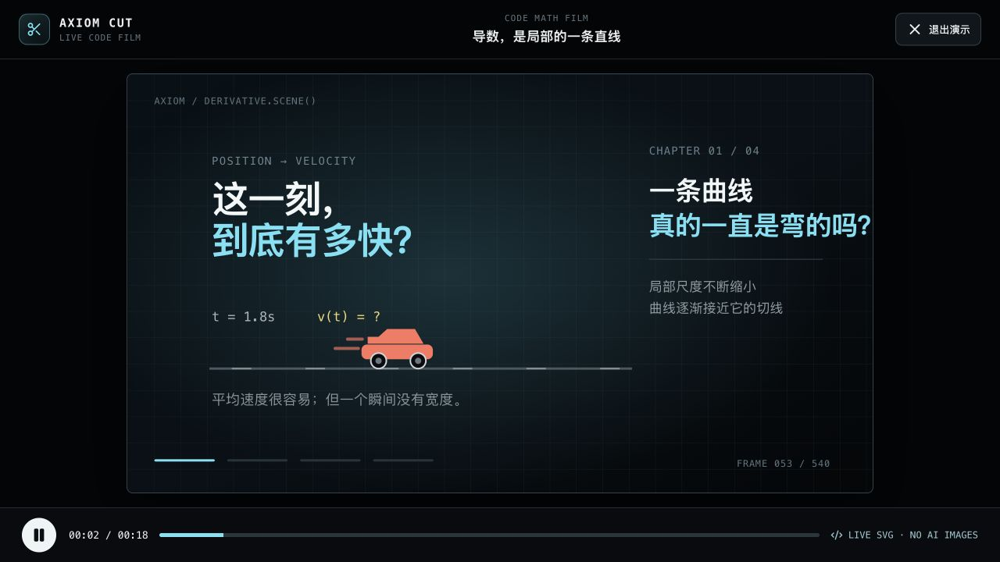
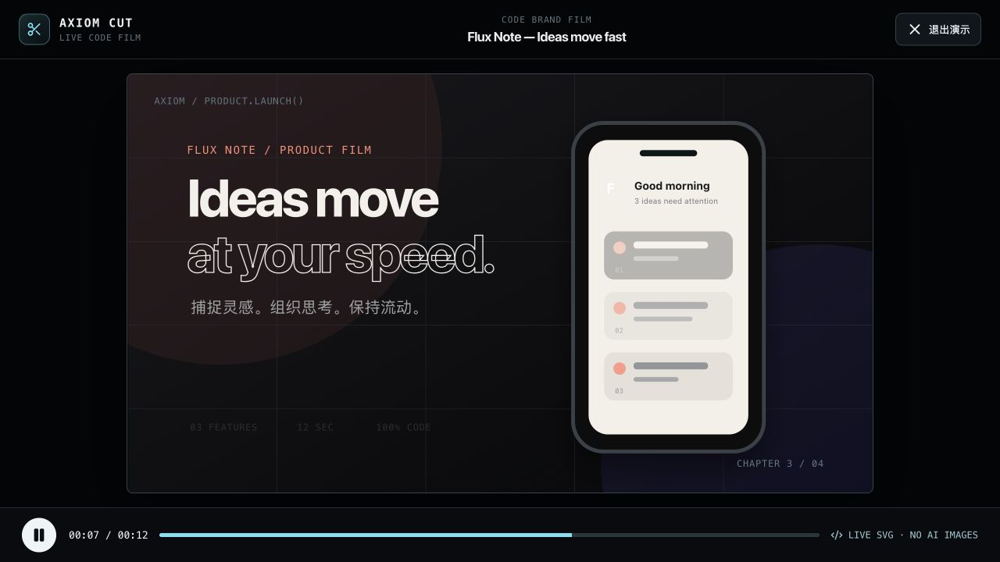

# Axiom Cut

A code-directed video editing Agent. Upload a real video or start from a built-in scene, describe the edit in natural language, then inspect the exact SVG, CSS and frame-based operations used to create the result.





## Why this project

The assignment asks for basic editing, a usable human-in-the-loop interface, and an Agent that can perform editing work. Axiom Cut makes the result inspectable: the model proposes a structured plan and parameters, while deterministic React/SVG/video layers produce the pixels. The user can always compare the original with the code-enhanced version.

Version 0.4 is presentation-first. The default canvas is substantially larger, all UI copy has a readable 11px minimum, comparison uses a full-size wipe instead of two miniature canvases, and one click opens a clean full-screen film mode. Both built-in films run from typed scene specs that are also shown in the code drawer; no generated image is used.

## Run locally

Requirements: Node.js 20+

```bash
npm install
cp .env.example .env
npm run dev
```

Open <http://127.0.0.1:4173>. Without an API key the full UI runs in local demo mode.

To use the fully static demo, run `npm run build` and open `dist/index.html`. The app automatically falls back to its deterministic local Agent when no API server is available.

## DeepSeek setup

Put the API key in `.env` on the server:

```bash
DEEPSEEK_API_KEY=your_key
DEEPSEEK_MODEL=deepseek-v4-flash
```

The browser calls `/api/plan` and `/api/evolve`; the key is never sent to the client. The server uses DeepSeek's OpenAI-compatible `POST /chat/completions` endpoint with JSON Output.

## Two comparison demos

Choose either project in the top bar:

- **Derivative / local linearity** — an 18-second, four-chapter story: a code-drawn car asks the instantaneous-speed question, then a curve, secant, shrinking difference and tangent assemble from one exact Bézier function.
- **Flux Note product launch** — a 12-second brand film with staged typography, product UI cards, feature timing and CTA motion.

Use **基础版 / 前后对比 / 代码成片** above the preview. Comparison keeps both versions at the full 16:9 size and reveals the enhanced version through a wipe. Click **查看场景代码** to inspect the same typed scene spec used by the renderer, or **演示播放** for a clean 1280×720 presentation view.

## Upload a video

Click **上传视频** and choose an MP4, MOV or WebM file. The browser creates a local Object URL: the video itself is not sent to DeepSeek. Toggle auto captions, smart crop, parameterized color and motion graphics, then describe the desired edit in the Director panel. DeepSeek receives only the written brief; the current demo overlays code-driven layers on the local video.

See [docs/EVOLUTION.md](docs/EVOLUTION.md) for the data contract and safety boundaries.

## Product flow

```text
Local video or code scene + natural-language brief
        ↓
DeepSeek structured plan and parameters
        ↓
Video source + SVG/CSS layers + frame timeline
        ↓
Original/enhanced comparison → reproducible project JSON
```

## Roadmap

- [x] General video-editing studio and local upload preview
- [x] Full-size original/code-enhanced wipe comparison
- [x] One-click full-screen presentation mode
- [x] Product-launch and mathematical comparison demos
- [x] Typed scene specs used as the visible source of truth
- [x] Four-stage, frame-driven mathematical narrative
- [x] Visible Agent plan, pipeline, and current step
- [x] DeepSeek structured planning and evolution APIs
- [x] Demo mode without credentials
- [x] Static-file demo and reproducible project JSON export
- [ ] Remotion composition generation
- [ ] Media metadata, speech transcription and shot detection
- [ ] FFmpeg/Remotion render queue and MP4 export
- [ ] Human approval gates and iterative revision

## Open-source notes

- License: MIT
- No 3Blue1Brown artwork, logo, or source material is included. The interface uses an original, code-native mathematical-animation aesthetic.
- Do not commit `.env` or API keys.

## Tech stack

React, TypeScript, Vite, Express, HTML5 Video, SVG/CSS animation, and DeepSeek API.
